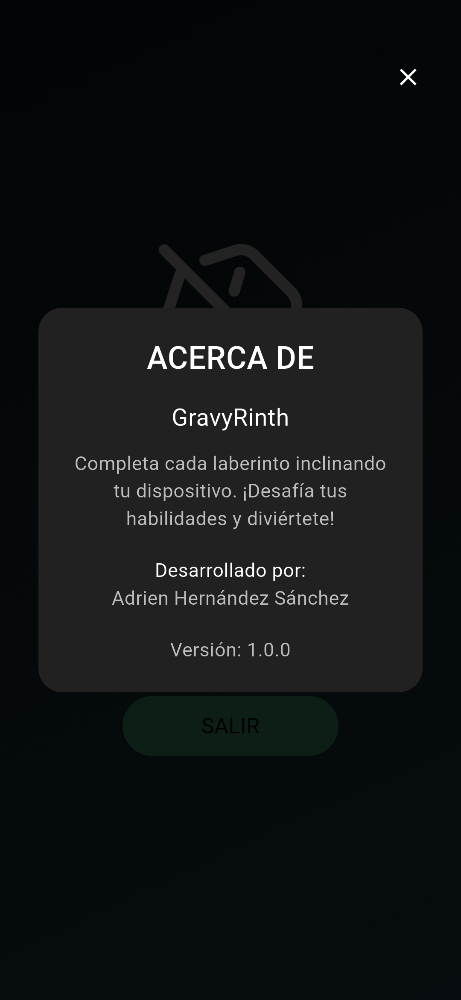
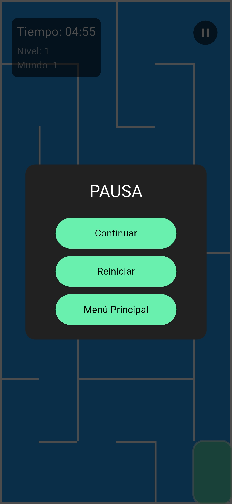
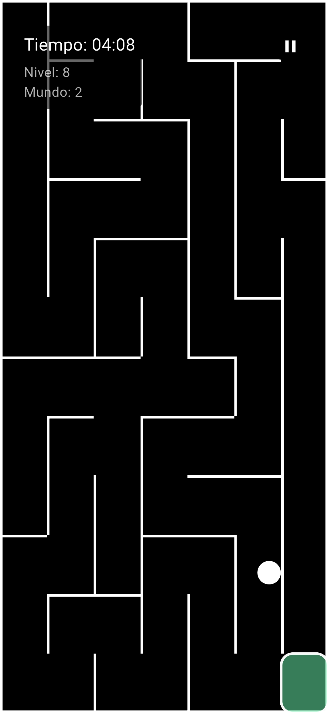
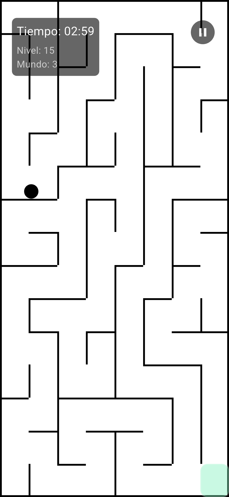
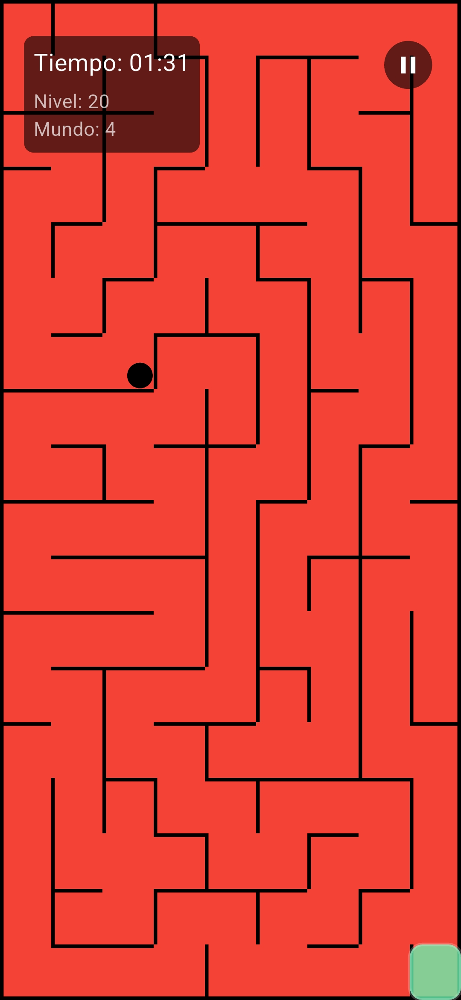
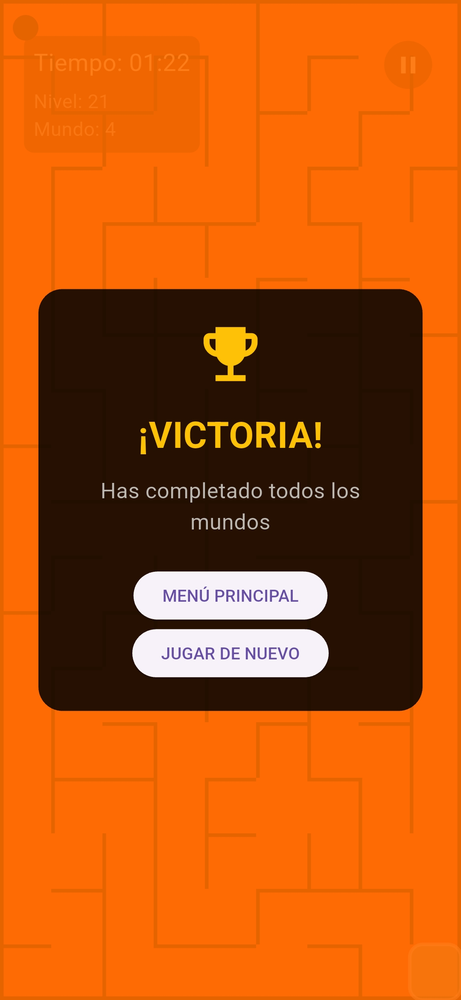
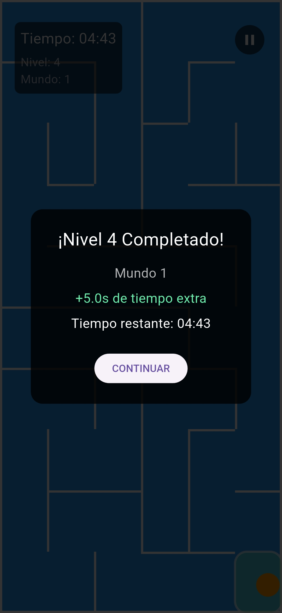
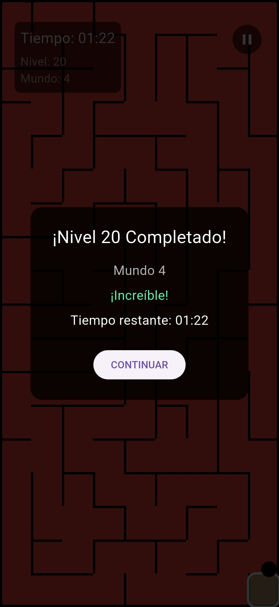
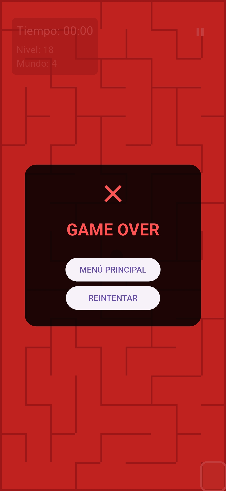

# 🎮 GravyRinth

GravyRinth is a mobile game developed with Flutter in which the player must guide a ball through dynamically generated mazes using the device’s accelerometer.

## 🛠 Technologies Used

This project was developed using the following technologies and dependencies:

- 🔥 Flame – A Flutter-based game engine used for game logic, rendering, and update cycle management.
- 📱 sensors_plus – Used to access the device's accelerometer and control the ball’s movement.
- 🔊 audioplayers – For background music and sound effects playback.
- 🎯 Flutter – Main framework used for building the application and UI components.

## 🎮 Game Description

The objective of the game is to guide a ball through increasingly complex mazes by tilting the mobile device.

The game features:

- 🧩 20 levels
- 🌀 Dynamically generated mazes using the DFS (Depth-First Search) algorithm
- ❌ No predefined maze layouts
- ⏳ Time-based gameplay with progressive bonus rewards

## 🧠 Maze Generation

Each level generates a maze dynamically using the Depth-First Search (DFS) algorithm.

This ensures that every playthrough delivers a unique experience, with no pre-designed maze structures.

## ⏳ Time System

At the start of the game, the player is given:

5 minutes (300 seconds)

Upon completing a level, bonus time is awarded based on progression:

| Levels  | Time Bonus      |
|---------|-----------------|
| 1 – 5   | +5 seconds     |
| 6 – 10  | +4 seconds     |
| 11 – 15 | +3 seconds     |
| 16 – 20 | +2 seconds     |

If the total time runs out:

- 🛑 The game ends
- 🔁 The game restarts from Level 1
- ❌ No progress is saved

## 📱 Player Controls

The ball is controlled using the device’s accelerometer.

Depending on how the phone is tilted:

- The ball rolls in the corresponding direction
- Simulating a realistic rolling motion

## 🔊 Sound

The game includes:

- 🎵 Global background music
- 🎉 Special sound effects for victory and defeat

## 📸 Previews

  
  

  
  

  
  

  
  

  
  

  

## 🙌 Assets Attribution

This project uses external visual and audio assets sourced from:

- Flaticon (https://www.flaticon.es/)
- Pixabay (https://pixabay.com/)
- OpenGameArt (https://opengameart.org/)

All assets remain the property of their respective authors.
Proper credit is given according to the license terms of each resource.